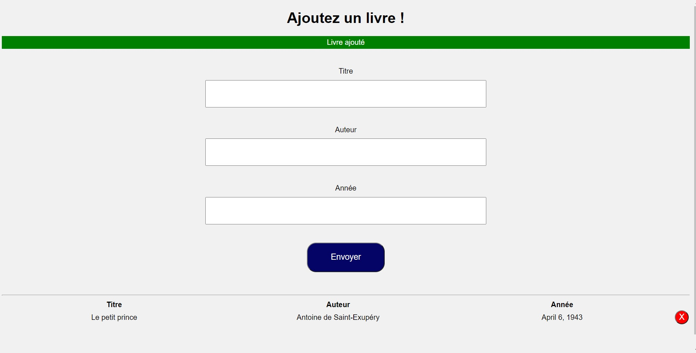

## Project Screen Shot  
#### Landing page: 

# Library-colection-app

#### keep your collection:
Just a simple excercice on vanilla.js, the idea was to create an app that can save the data inputs. In these exemple it was related to books. 

## Project Status
The project is finish and i'm moving on to another one. i'm open to proposition or critics. Feel free to use it and change it as you will. 

## Contacte me: 

